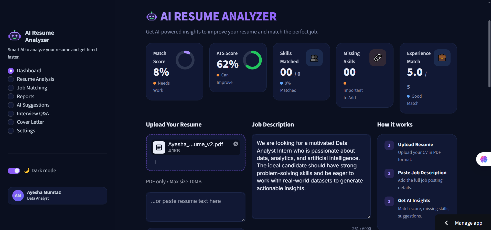
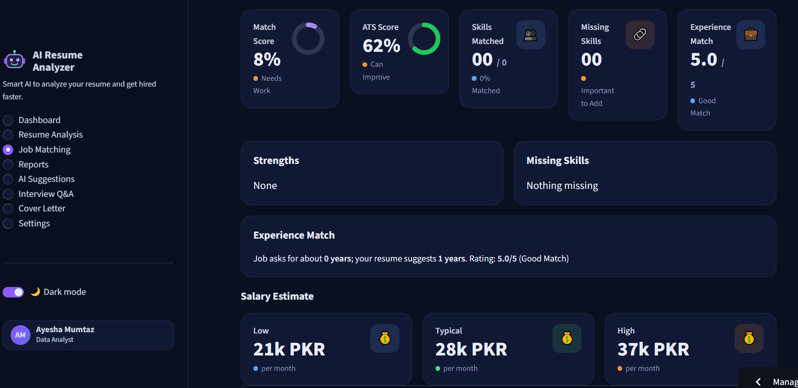
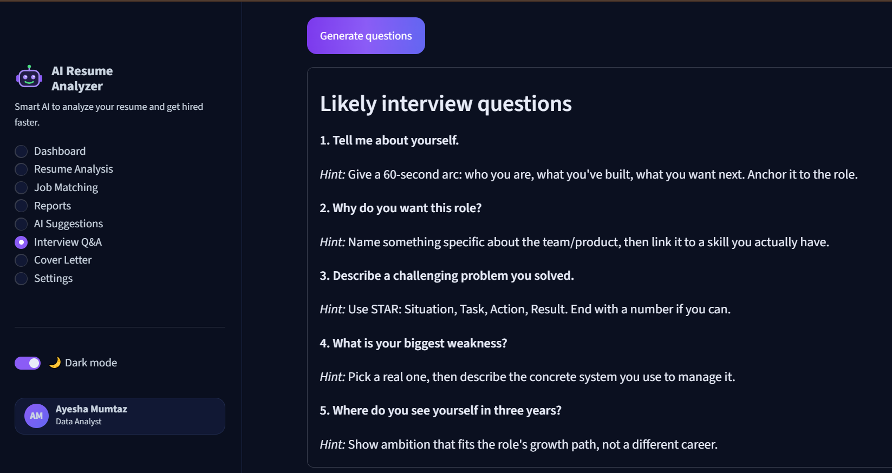

# 🎯 AI Resume Analyzer

**Match any resume to any job in seconds — score it, find the gaps, and fix them**


**Built by Ayesha Mumtaz**

AI Resume Analyzer takes a PDF resume and a job description, then returns a match
score, an ATS score, a skill-gap breakdown and rewritten bullet points — plus a
cover letter, likely interview questions and a learning roadmap, all from one
dashboard that works with **no API key required**.

[Overview](#overview) · [Demo](#demo) · [Screenshots](#screenshots) · [Features](#features) · [Architecture](#architecture) · [Tech Stack](#tech-stack) · [Scoring Engine](#scoring-engine) · [Getting Started](#getting-started) · [Troubleshooting](#troubleshooting)

---

## Quick Start

```bash
git clone https://github.com/ayeshamumtaz1057/ai-resume-analyzer.git
cd ai-resume-analyzer
pip install -r requirements.txt
streamlit run app.py
```

Open the app once it starts:

**App:** http://localhost:8501

That's the whole setup. **No API key, no model download, no login.** The AI
features run on rule-based engines by default; adding a Gemini key upgrades them
without changing a line of code.

---

## Overview

Job seekers are told to "tailor your resume to each job" — but nobody tells them
*what* to change. This project answers that question with numbers.

### The Problem

Applying for a job today means guessing. You don't know whether an Applicant
Tracking System will parse your resume. You don't know which of the job's
required skills you're missing. You don't know if your bullet points are strong
or forgettable. So people send the same generic resume to fifty companies and
hear nothing back.

Paid tools exist, but they lock the useful parts behind a subscription and ask
you to upload your resume to a stranger's server.

### The Solution

AI Resume Analyzer measures what can be measured and explains the rest:

1. **Upload** — drop in a PDF resume, or paste the text
2. **Paste** — add the full job description
3. **Analyze** — five scores computed locally in under two seconds
4. **Act** — rewritten bullets, a cover letter, interview prep, a study plan

Every number comes with a reason. A 67% ATS score isn't a verdict, it's a
checklist of six things that either passed or didn't.

---

## Demo

> **Live app:** _https://ai-resume-analyzer-7hydahamgyp79ipcrtyhvl.streamlit.app/_
>
> **Video walkthrough:** _https://www.linkedin.com/in/ayesha-mumtaz-82b8913a9/_

---

## Screenshots

_Add your screenshots to the `assets/screenshots/` folder and these render
automatically._

### Dashboard
Five metric cards, a donut overview, animated skill bars and a score-history
chart. The dark violet theme and hover-lift cards are hand-written CSS injected
over Streamlit's defaults.



### Skill Gap Analysis
Matched skills in green, missing skills in orange with **High / Medium / Low**
priority badges derived from how the job description phrases each requirement.



### AI Tools
Cover letter generator, interview Q&A and a week-by-week learning roadmap — each
with a deterministic fallback so they work without a key.



---

## Features

### Scoring & Analysis

| Feature | Description |
|---|---|
| **Match Score** | TF-IDF vectorization + cosine similarity between resume and job text (0–100%) |
| **ATS Score** | Six weighted checks: contact details, standard sections, keyword coverage, quantified results, action verbs, length |
| **Skill Gap** | 108 skills across 8 categories, matched with boundary-aware regex so `c++`, `c#` and `node.js` survive tokenization |
| **Experience Match** | 0–5 rating inferred from year mentions, date ranges and seniority keywords in both documents |
| **Priority Ranking** | Missing skills labelled High / Medium / Low based on whether the job says *required*, *must have* or *nice to have* |
| **Partial Match** | Flags skills the resume mentions exactly once — a keyword without evidence behind it |
| **Overall Strength** | Weighted blend of match, ATS and experience into a single verdict |

### AI Tools

| Feature | Description |
|---|---|
| **Improvement Suggestions** | Targeted advice built from the score and skill gap |
| **Resume Rewrite** | Weak bullets rewritten into strong, quantified ones, shown as Before / After |
| **Cover Letter** | Tailored letter using only skills actually found in the resume, downloadable |
| **Interview Q&A** | Likely technical and behavioural questions with answer hints |
| **Salary Estimator** | PKR monthly band from seniority and role signals, with reasoning shown |
| **Learning Roadmap** | 4–16 week plan covering the missing skills, with a project and free resource per week |

### System

| Feature | Description |
|---|---|
| **Zero-Config Demo** | Every feature works with no API key — rule-based engines fill in |
| **Bring Your Own Key** | Add `GEMINI_API_KEY` locally or in hosting secrets to upgrade the AI layer |
| **Dark / Light Mode** | Dark violet palette by default, toggleable |
| **Score History** | SVG line chart tracking match scores across analyses in a session |
| **Resume Preview** | Paginated view of the extracted text, so you see what the parser saw |
| **Export** | Download the full analysis as a Markdown report |
| **Tested** | 31 pytest cases across preprocessing, similarity, skills, ATS, insights and tools |

---

## Architecture

```
              User (Browser)
        Streamlit UI + custom CSS
                    │
                    │  page router
                    ▼
      ┌──────────────────────────────┐
      │           app.py             │
      │  sidebar · header · 8 pages  │
      └──────────────┬───────────────┘
                     │
     ┌───────────────┼───────────────┐
     ▼               ▼               ▼
┌─────────┐   ┌────────────┐   ┌──────────┐
│ Extract │   │   Score    │   │  Advise  │
└────┬────┘   └─────┬──────┘   └────┬─────┘
     │              │               │
     ▼              ▼               ▼
┌──────────────────────────────────────────┐
│                 utils/                   │
│                                          │
│  pdf_reader.py  ── PyPDF2 text extraction│
│  preprocess.py  ── spaCy clean + tokenize│
│  similarity.py  ── TF-IDF cosine score   │
│  skills.py      ── 108-skill catalogue   │
│  ats.py         ── 6-check ATS scoring   │
│  insights.py    ── experience · priority │
│  extras.py      ── letter · Q&A · roadmap│
│  ai_helper.py   ── Gemini + fallback     │
└──────────────────────────────────────────┘
```

**Flow:** `app.py` holds the UI and nothing else — every calculation lives in
`utils/`. Each module is independent and imports at most one sibling, so a module
can be tested, replaced or reused on its own.

All model calls funnel through `ai_helper.py`, which means retry logic, key
resolution and the no-key fallback exist in exactly one place. Every AI feature
in `extras.py` calls the same `_try(prompt, fallback)` helper — if the API is
missing, rate-limited or broken, the user gets a useful answer instead of a
stack trace.

**Why it's structured this way:** adding a new scoring signal touches two files —
one function in `utils/`, one card in `app.py`. Nothing existing changes.

---

## Tech Stack

| Layer | Technology |
|---|---|
| Frontend | Streamlit 1.40 with custom CSS injection |
| UI Style | Dark violet palette, gradient wordmark, hover-lift cards, SVG charts |
| PDF Parsing | PyPDF2 |
| NLP | spaCy 3.7 (blank English pipeline + built-in stop words) |
| Scoring | scikit-learn TF-IDF + cosine similarity |
| AI Layer | Google Gemini API (`gemini-1.5-flash`), optional |
| Config | python-dotenv |
| Charts | Hand-written SVG (donut rings, line chart, progress bars) |
| Testing | pytest — 31 cases |
| Deployment | Streamlit Community Cloud |

### Why these choices

| Decision | Reasoning |
|---|---|
| **spaCy blank pipeline over `en_core_web_sm`** | The full model is a 12 MB download that frequently fails on free hosting tiers. A blank pipeline gives the tokenizer and stop words — everything this project actually uses — with zero download and instant startup. |
| **TF-IDF over sentence embeddings** | Embeddings mean an API call per document, which adds latency and cost to a free demo. TF-IDF is instant, local, deterministic, and well suited to keyword-driven resume matching. |
| **Rules first, model second** | ATS scoring never needed AI. Regex and counting give an instant, free, reproducible result. The model adds value by *rewriting* bullets — doing what rules can't, rather than what rules do better. |
| **Hand-written SVG over Plotly** | Five small charts didn't justify a charting dependency. Raw SVG gave exact control over the dark theme, hover tooltips and entry animations, and adds nothing to install time. |
| **Session state over a database** | The analysis is a single sitting, not a long-term record. Keeping history in `st.session_state` avoids a database, a schema and a deployment concern for something the user doesn't need persisted. |
| **PyPDF2 over pdfplumber** | Lighter dependency, faster install on a free tier, and adequate for the text-based PDFs resumes almost always are. |

---

## Scoring Engine

The scoring layer is the technical core. Everything is computed locally and
deterministically — the same inputs always produce the same numbers.

### Match Score — TF-IDF + cosine similarity

```
Resume text ──┐
              ├──► clean (lowercase, strip, stop words) ──► TF-IDF vectors
Job text ─────┘                                                   │
                                                                  ▼
                                                     cosine similarity → 0–100%
```

Preprocessing deliberately preserves `+`, `#` and `.` so that `c++`, `c#` and
`node.js` survive cleaning. spaCy's tokenizer splits `c#` into `c` and `#` by
default, so those tokens are registered as explicit special cases:

```python
_SPECIAL_TOKENS = ["c++", "c#", "f#", "node.js", "asp.net", ".net"]
for _tok in _SPECIAL_TOKENS:
    _nlp.tokenizer.add_special_case(_tok, [{"ORTH": _tok}])
```

### ATS Score — six weighted checks

| Check | Method | Weight |
|---|---|---|
| Contact details | Regex for email, phone and profile link | 15 |
| Standard sections | Experience, education, skills, projects, summary | 25 |
| Keyword coverage | Job skills present in the resume, as a ratio | 30 |
| Measurable results | Count of numeric and percentage mentions | 15 |
| Action verbs | Set intersection against a strong-verb list | 8 |
| Length | Word-count bands (250–1200 optimal) | 7 |

Each check returns `passed` and a human-readable `detail`, so the UI can explain
*why* a score is what it is rather than just displaying a number.

### Skill matching — why word boundaries matter

A naive substring search matches `r` inside `learn`, `go` inside `google` and
`c` inside every word on the page. Every skill is compiled to a boundary-aware
pattern instead:

```python
re.compile(rf"(?<![a-z0-9]){re.escape(skill)}(?![a-z0-9])", re.IGNORECASE)
```

Lookarounds are used rather than `\b` because `\b` breaks on `c++` and `c#`,
where the trailing character isn't a word character.

### Priority ranking

Missing skills aren't equally urgent. Each is classified by reading the sentence
that mentions it in the job description:

| Signal in context | Priority |
|---|---|
| *required*, *must have*, *essential*, *strong*, *proficient* | **High** |
| *nice to have*, *plus*, *bonus*, *preferred* | **Low** |
| Mentioned twice or more | **High** |
| Otherwise | **Medium** |

### Characteristics

| Property | Value |
|---|---|
| Skills catalogue | 108 skills across 8 categories |
| ATS checks | 6 weighted, 100 points total |
| Analysis time | Under 2 seconds for a typical resume |
| Model calls required | Zero — the AI layer is strictly additive |
| Determinism | Same inputs always produce the same scores |
| Fallback | Every AI tool has a rule-based equivalent |

---

## Project Structure

```
ai-resume-analyzer/
├── app.py                       Streamlit UI: sidebar, header, 8 pages
├── requirements.txt             Python dependencies
├── .env.example                 Environment template
│
├── .streamlit/
│   └── config.toml              Dark theme configuration
│
├── utils/                       All logic — app.py holds none
│   ├── pdf_reader.py            PyPDF2 extraction (path / bytes / upload)
│   ├── preprocess.py            spaCy cleaning, tokenizing, special cases
│   ├── similarity.py            TF-IDF vectors + cosine similarity
│   ├── skills.py                108-skill catalogue, boundary-aware matching
│   ├── ats.py                   Six-check ATS scoring with explanations
│   ├── insights.py              Experience match, priority, partial, strength
│   ├── extras.py                Rewrite, cover letter, Q&A, salary, roadmap
│   └── ai_helper.py             Gemini wrapper, key resolution, fallback
│
├── tests/                       31 pytest cases
│   ├── test_preprocess.py
│   ├── test_similarity.py
│   ├── test_skills.py
│   ├── test_ats.py
│   ├── test_insights.py
│   └── test_extras.py
│
├── data/
│   ├── sample_resume.pdf        Demo resume
│   └── sample_job.txt           Demo job description
│
├── assets/
│   ├── logo.png
│   └── screenshots/
│
├── README.md
├── DEPLOYMENT.md                Extended deployment guide
└── .gitignore
```

---

## Getting Started

### Prerequisites

| Requirement | Version | Required? |
|---|---|---|
| Python | 3.9+ | Yes |
| Gemini API key | — | **No** — optional upgrade only |

### Manual setup

**1. Clone and enter the project**

```bash
git clone https://github.com/ayeshamumtaz1057/ai-resume-analyzer.git
cd ai-resume-analyzer
```

**2. Create and activate a virtual environment**

```bash
python -m venv venv

venv\Scripts\activate           # Windows
source venv/bin/activate        # macOS / Linux
```

Your prompt should now begin with `(venv)`.

**3. Install dependencies**

```bash
pip install -r requirements.txt
```

**4. Run**

```bash
streamlit run app.py
```

**5. Try it**

Upload `data/sample_resume.pdf`, paste the contents of `data/sample_job.txt`,
and click **Analyze Resume**.

### Optional: enable Gemini

```bash
cp .env.example .env            # Windows: copy .env.example .env
```

Then open `.env` and paste a free key from
[Google AI Studio](https://aistudio.google.com/apikey):

```
GEMINI_API_KEY=your_key_here
```

| Variable | Default | Description |
|---|---|---|
| `GEMINI_API_KEY` | — | Optional. Upgrades suggestions, rewrites, letters and Q&A |

The key is resolved in this order: **environment variable → hosting secrets →
`.env` file**, so the same code runs locally and deployed without modification.

> ⚠️ Never commit your `.env` file. `.gitignore` already excludes it — use
> `.env.example` as the template.

### Running tests

```bash
pytest -q
```

---

## Deployment

### Streamlit Community Cloud (free)

1. Push this repository to GitHub as **public**
2. Go to [share.streamlit.io](https://share.streamlit.io) → **Create app**
3. Repository `ayeshamumtaz1057/ai-resume-analyzer`, branch `main`, main file `app.py`
4. **Deploy**

That's it — no secrets needed. The app is fully functional without a key, which
means a recruiter clicking your link gets a working demo immediately.

To enable the Gemini layer, add under **Manage app → Settings → Secrets**:

```toml
GEMINI_API_KEY = "your_key_here"
```

> **Note:** free-tier apps sleep after inactivity. Open your link once before
> sharing it so visitors don't hit the wake-up screen.

Extended instructions are in [`DEPLOYMENT.md`](DEPLOYMENT.md).

---

## Troubleshooting

### Setup

| Error | Fix |
|---|---|
| `'python' is not recognized` | Reinstall Python and tick **Add Python to PATH**, or use `py` on Windows |
| `ModuleNotFoundError: No module named 'streamlit'` | Virtual environment isn't active — activate it, then reinstall requirements |
| `Can't find model 'en_core_web_sm'` | Not needed. This project uses `spacy.blank("en")` deliberately — no model download required |

### Runtime

| Error | Fix |
|---|---|
| Match score is 0% | One of the two inputs is empty, or the PDF is a scan with no selectable text |
| PDF uploads but no text appears | The PDF is an image scan. PyPDF2 can't read it — export a text-based PDF from Word or Google Docs |
| Skills show as missing when they're in my resume | Check spelling against the catalogue in `utils/skills.py`, or add the term to `SKILLS_DB` |
| AI tools return template text | Expected without a key — that's the fallback working. Add `GEMINI_API_KEY` for model-written output |
| `429 Resource has been exhausted` | Free Gemini quota hit. Wait a minute; the app falls back automatically in the meantime |
| Score History says "run more analyses" | The chart needs at least two data points in a session |

### Git & GitHub

| Error | Fix |
|---|---|
| `! [rejected] main -> main (fetch first)` | Remote has commits you don't. `git push -u origin main --force` |
| `fatal: repository '.../tree/main/' not found` | URL copied from the browser bar. `git remote set-url origin https://github.com/USER/REPO.git` |
| `Could not resolve host: github.com` | Network or DNS issue, not Git. Try a mobile hotspot, or set DNS to `8.8.8.8` |
| `Support for password authentication was removed` | Use a Personal Access Token: Settings → Developer settings → Tokens (classic) → scope `repo` |
| `ModuleNotFoundError: No module named 'utils'` after deploying | The `utils` folder didn't upload as a folder. `app.py` and `utils/` must both sit at the repo root |

### Deployment

| Error | Fix |
|---|---|
| `Main file does not exist` | `app.py` is nested one folder deep. Re-upload the folder's *contents*, not the folder |
| App shows a wake-up button | Free tier sleeping. Open the link once before sharing |
| Score history resets | Expected — history is session-scoped by design |

---

## What I Learned

**Deployment constraints shape design.** The first version used `en_core_web_sm`
and pdfplumber. Both worked locally and both were liabilities on a free tier — a
model download that can time out, and a heavier install. Switching to a blank
spaCy pipeline and PyPDF2 kept every feature and made the deploy reliable.

**Word boundaries are harder than they look.** `\b` fails on `c++` and `c#`
because `+` and `#` aren't word characters, so `\bc\b` matched the `c` in `c++`
and produced false skill matches. Lookarounds solved it. A regex bug like this
silently produces wrong output rather than crashing, which is why the test suite
covers it explicitly.

**Design your failure modes first.** Every AI feature was built with its
fallback written *before* the API call. Quota runs out, keys expire, networks
drop — and a demo that degrades gracefully beats one that shows a stack trace to
whoever happens to be looking.

**Rules and models are complementary, not competing.** ATS scoring never needed
a model: regex and counting give a deterministic, instant, free result that's
also explainable. The model earns its place by rewriting bullet points — work
rules genuinely can't do.

**Scores need reasons.** An early version showed "ATS Score: 67%" and nothing
else, which is useless advice. Returning a `passed` flag and a `detail` string
per check turned a number into a to-do list.

---

## Roadmap

- [ ] Sentence-transformer embeddings as a TF-IDF upgrade
- [ ] Rank multiple resumes against a single job posting
- [ ] Section-aware parsing (experience, education, projects) rather than flat text
- [ ] PDF export of the analysis report
- [ ] Persist history across sessions with SQLite
- [ ] Live salary data instead of the current heuristic bands
- [ ] Urdu interface translation
- [ ] CI pipeline running the test suite on every push

---

## Contributing

Contributions are welcome.

```bash
git checkout -b feature/your-feature
git commit -m "Add your feature"
git push origin feature/your-feature
```

Please keep all logic in `utils/` (never in `app.py`), route every model call
through `ai_helper.py`, and add a test for any new scoring signal.

### Adding a skill

```python
# utils/skills.py
SKILLS_DB["Data & AI/ML"].append("langchain")
```

It appears in matching, gap analysis, priority ranking and the roadmap
automatically.

---

## License

Distributed under the MIT License. See `LICENSE` for details.

---

## Acknowledgements

- **Streamlit** — the framework that made a dashboard feasible in days
- **spaCy** — tokenization and stop words without the model overhead
- **scikit-learn** — TF-IDF and cosine similarity
- **Google AI Studio** — free Gemini API access

---

## Author

**Ayesha Mumtaz**
BS Information Technology

[GitHub](https://github.com/ayeshamumtaz1057) · [LinkedIn](https://www.linkedin.com)

---

⭐ **Star this repo if you found it useful**
